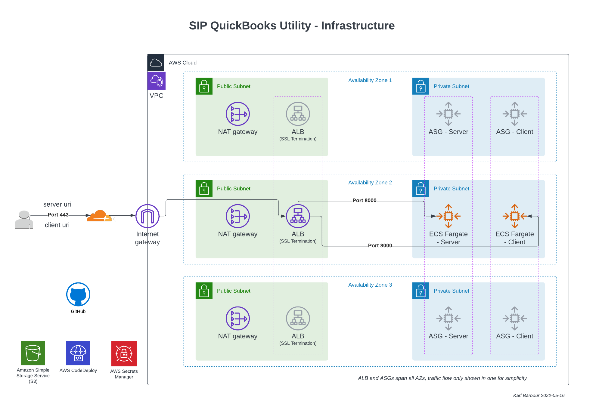

## SIP QuickBooks Utility

## Architecture Diagram

## Introduction

The QuickBooks utility consists of two components:

- `client` - A NodeJS w/ React application designed to be consumed by users in their browser. The user will click "connect", enter into an OAuth flow with Quickbooks, then retrieve their data from QuickBooks. This will then be processed and converted into a format ready to import into SIP.
- `server` - A NodeJS API designed to be consumed by the client application. It interfaces with QuickBooks APIs.

_Further information can be provided by Rohit Kumar_

Each component is built into a Docker image and pushed to ECR to be deployed on ECS Fargate behind an ALB. On entrypoint, the container will retrieve environment files from AWS SecretsManager and populate a .env file before starting the node server.

POC URLs:

- https://sipqbutil-dev-client.sagecloudops.com/
- https://sipqbutil-dev-server.sagecloudops.com/

## Repo Structure

- `.github/workflows/` - GitHub actions worklows.
- `client/` - Source code for CLIENT service. Includes dockerfile and supporting config/scripts.
- `server/` - Source code for CLIENT service. Includes dockerfile and supporting config/scripts.
- `docs/` - Documentation.
- `terraform/` - Terraform

## Adding a new environment

1. Add a new environment to https://github.com/Sage-CloudOps/SIP-QBUtil-IAC/settings/environments
   - Secrets:
     - `AWS_ACCESS_KEY_ID`: AWS public access key for target AWS account
     - `AWS_SECRET_ACCESS_KEY`: AWS secret access key for target AWS account
     - `CLOUDFLARE_API_TOKEN`: CloudFlare API token used to add/update DNS entries in Terraform. Can restrict token to just DNS read/write for zone.
       - ALB Module: Adds DNS Validation records for ACM certificate
       - ecs_service module: Adds DNS records for ALB endpoint (for both client and server)
   - Environment Variables (these cannot be in a `tfvars` file, so we use GHA Environments)
     - `AWS_REGION`
     - `TF_BACKEND_S3_BUCKET`
     - `TF_BACKEND_S3_KEY`
1. Add a new `tfvars` file to `terraform/<envname>.tfvars`
   - No secrets are stored here.
   - Copy `terraform/dev.tfvars` as a starting point.
1. Add a new workflow file to `.github/workflows/<envname>.yml`
   - Copy `.github/workflows/dev.yml` as a starting point.
   - Should be able to find+replace `dev` with new environment name.
   - This is, for POC purposes, designed to be one branch per environment. Future improvement would be to enable promotion through environments.

## Deploying

The GHA pipeline will trigger a deployment to the `dev` environment on any commit to `main` by default. This will need tweaked by CloudOps team.

The workflow will carry out the following actions:

1. In parallel, build both server and client docker images, then login and push to ECR.
   - If repository does not exist in target account, pipeline should create it (name "qbutil-client" and "qbutil-server" - may want to parameterise this)
1. Once docker images are ready, initiate terraform deployment.
1. Create bucket to store backend file (terraform state)
1. Prepare backend file (this will replace tokens in `terraform/backend.tf` with those from GitHub environment variables)
1. Run `terraform plan`
1. Run `terraform apply`
